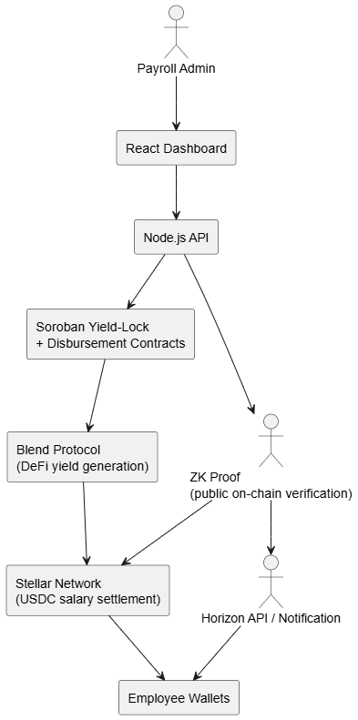

  ## Table of Contents

  - [1. Problem Statement](#1-problem-statement)
  - [2. Target User and User Need](#2-target-user-and-user-need)
  - [3. Solution Overview](#3-solution-overview)
    - [3.1 Main Idea](#31-main-idea)
    - [3.2 Why Stellar?](#32-why-stellar)
  - [Core Features (Hackathon Scope)](#core-features-hackathon-scope)
  - [MVP Architecture](#mvp-architecture)
  - [Hackathon Success Criteria](#hackathon-success-criteria)
  - [7. Team](#7-team)

  ## 1. Problem Statement

  What real-world problem are you solving?
  - In LatAm, millions of employees and suppliers face delayed payments because small businesses rely on manual processes with no automation and zero transparency. No one knows when payments will actually be made, there's no real-time visibility, and the money sitting idle loses value every single day. This lack of reliability creates stress, distrust, and constant workplace conflict. Today, there is no system that guarantees timely, verifiable payments.

  For whom is this a problem?
  - This problem affects organizations that depend on recurring payroll and supplier payments, including remote-first teams, companies with distributed international workforces, and businesses that manage large payroll reserves each month.
  It especially impacts employers operating in emerging markets, where payment delays, banking friction, and currency instability create real hardship for employees, contractors, and suppliers.

  Finance and payroll teams face operational pressure, while workers experience uncertainty, late payments, and erosion of trust — all stemming from outdated, manual, and opaque payout processes.

  Why is this problem urgent now?
  - Today, LATAM’s workforce is more remote, diverse, and digitally savvy than ever, and competition for talent is fierce. Employees and suppliers are demanding payment certainty—not just faster payouts, but guaranteed, automated, and provable on-time delivery. Businesses that keep delaying or rely on opaque, manual processes lose credibility, risk regulatory penalties, and see top talent walk out the door.
  StellarPay leverages the breakthrough of Soroban smart contracts to make true automation, yield on idle payroll, and zero-knowledge proof of timeliness possible for the first time. In a region where financial stress and payment anxiety hit hardest, automating salary delivery isn't just efficiency—it's critical for survival. The market is shifting now, and companies who act today will lead; those who wait will lose trust and be left behind.

  ## 2. Target User and User Need

  Primary user:
  - Finance/payroll managers at remote-first companies (50-500 employees) managing $100K-$5M monthly payroll across multiple countries.bitwage+1
  - Core need:
  Automate payroll distribution with predictable timing while generating yield on pre-payroll capital reserves, without sacrificing employee privacy or compliance requirements.onesafe+1
  - Current workarounds:
  Manual processing through traditional banking (taking 3-8 hours per cycle), using Bitwage or similar crypto payroll services without yield optimization, or accepting zero returns on payroll capital held in checking accounts.stellar+1

  ## 3. Solution Overview

  ### 3.1 Main Idea

  StellarPay is a Soroban-powered payroll platform for LATAM businesses that transforms idle payroll funds into productive assets. Instead of letting cash sit for weeks before payday, companies deposit funds into yield-generating smart contracts, earning 4-6% APY in DeFi protocols while payroll is scheduled. On payday, Soroban automates exact, on-time distribution in USDC via Stellar’s network—delivering instant, transparent payments without manual intervention or trust in human processes.

  - What sets PayDay apart:
  Zero-knowledge proofs publicly verify payment timing and compliance, proving every salary was paid on schedule to every recipient—without exposing amounts, employee identities, or company payroll sizes, solving the transparency vs. privacy paradox.
  Yield sharing: Generated yield is split, with 70% given to employees as bonuses and 30% returned to the employer for treasury optimization.
  No manual bottlenecks: Payroll admins deposit once—Soroban handles everything else, automatically, provably, and with complete transparency.
  Built for real LATAM needs: Automated compliance, instant cross-border settlement, and cash-out to local currencies empower both employees and suppliers.

  - Core user journey:
  Company deposits payroll (e.g., $500K) → funds earn yield in Soroban for 15-30 days → smart contract auto-distributes exact USDC salaries on payday (5-second Stellar settlement) → ZK proof published showing “100% on-time compliance” → yield split: 70% to employees, 30% to company.

  ### 3.2 Why Stellar?

  Global, real-time settlement: Stellar’s network delivers cross-border payroll in 5 seconds with fees under $0.0001—enabling instant, affordable payments to employees and suppliers in over 180 countries, including the most underbanked regions of LATAM.
  
  •	USDC and stablecoin support: Stellar’s natively integrated USDC enables businesses to pay and employees to receive in stable, dollar-pegged digital assets, protecting real income from currency swings and ensuring easy conversion to local money.
  
  •	Soroban smart contracts: Only Stellar combines proven payment rails with now-live Soroban smart contracts—enabling programmable, automated yield strategies, time-locked disbursements, and advanced features like zero-knowledge proofs for transparency without sacrificing privacy.
  
  •	Built-in compliance and on/off-ramps: Stellar’s ecosystem includes AML/KYC tools and 475,000+ accessible global endpoints—making it possible to comply with regulation while ensuring anyone can cash out salaries instantly in their home country.
  
  •	Enterprise-grade reliability: As proven by the BiGGER case and other deployments, Stellar supports secure, trusted, and scalable payroll operations already processing millions of dollars every month.

  ### Core Features (Hackathon Scope)

  •	Yield-Locked Payroll (Scroll): Company funds are deposited and “scrolled” (locked) into a Soroban smart contract, earning DeFi yield until payday.
  
  •	DeFindex Yield Module: Seamless integration with Blend or other Stellar DeFi protocols lets payroll capital earn transparent, real-time yield automatically.
  
  •	Abstract ZK Verifier: Zero-knowledge verification for every pay cycle—publish on-chain proofs that salary was paid on time, without exposing personal or financial data.

  ## MVP Architecture

  Frontend:  
  - React payroll admin dashboard  
  - Next.js employee portal for viewing real-time payment status, payment history, and yield bonuses

  Backend/Services:
  - Node.js API for:
    - Authentication and permissions  
    - CSV payroll uploads  
    - Soroban smart contract calls (payroll lock, yield actions, automated payout)  
    - ZK-SNARK proof generation for payment timeliness  
    - Real-time notification integration

  Smart Contracts:  
  - Yield-Lock Contract: Accepts payroll deposits, locks funds, routes them to Blend for yield, time-locked release to disbursement  
  - Disbursement Contract: Batch salary payout via Stellar, with on-chain event logs  
  - ZK Verifier Contract: Validates and stores zero-knowledge proofs for public, privacy-preserving verification of on-time payments

  Data/Storage:  
  - PostgreSQL: user accounts, payee lists, payment history, last proof status    
  - Stellar Horizon API: on-chain transaction/order monitoring

  System Flow: 

  

  ## Hackathon Success Criteria

  - Users can deposit a test payroll batch (≥10 recipients) into a Soroban contract, funds generate simulated yield, and the contract auto-distributes exact amounts on the scheduled payday.
  - The app generates and posts a zero-knowledge proof on-chain that confirms “100% on-time payments” without exposing salary or recipient identities.
  - Dashboard clearly visualizes at least 48 hours of yield accumulation, with actual APY and payout bonuses from Blend (or testnet DeFi).
  - Full integration with Stellar Disbursement Platform or direct Soroban-based batch payout, processing at least 10 payments in under 30 seconds.

  ## 7. Team

  Team name: Payday
        Members and roles:
        Nolan  Druid– Soroban smart contracts (yield lock, disbursement logic, DeFi integration)
        Diego Moron – Frontend (React dashboard, employee portal)
        Andrés Bustamantes – Backend/API (Node.js, ZK proof generation, SDP integration)
        Robert Sun – Product/Design (UX flows, compliance documentation)
        Leonardo Vaca – Product/Strategy Lead (user research, feature prioritization,business logic design)

