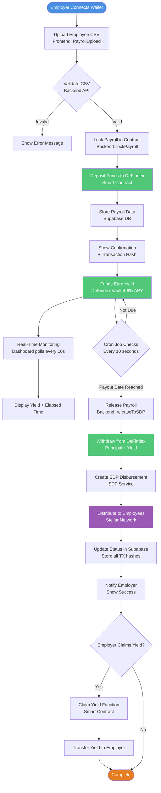

# PayDay - Automated Payroll with Yield Generation !!

> **Status:** ✅ Fully Functional | End-to-End Tested | Demo Ready

**Live Demo:** [Watch Video](#) | **Contract:** `CBTGFTP4WMHRAVJSUEC5HFX2L77ZE64R3YEJFLGUBD5WV5LWDFJIXH6H`

## 🚀 Quick Start (TL;DR)

PayDay transforms idle payroll funds into productive assets. Companies deposit payroll → funds earn 4-6% APY in DeFi → Soroban auto-distributes on payday → yield split between employer and employees.

**What's Working:**
- ✅ Smart contract deployed on Stellar Testnet
- ✅ Real DeFindex vault integration (actual yield generation)
- ✅ Automatic payroll release via cron (checks every 10s)
- ✅ Stellar Disbursement Platform integration
- ✅ Real-time yield tracking dashboard
- ✅ Full transaction verification on Stellar Expert

---

## Table of Contents

  - [Problem Statement](#1-problem-statement)
  - [Target User and User Need](#2-target-user-and-user-need)
  - [Solution Overview](#3-solution-overview)
  - [Demo Workflow](#demo-workflow)
  - [Core Features](#core-features-hackathon-scope)
  - [Architecture](#mvp-architecture)
  - [Environment Setup](#environment-setup)
  - [Team](#7-team)

---

## 1. Problem Statement

**What real-world problem are you solving?**

In LatAm, millions of employees and suppliers face delayed payments because small businesses rely on manual processes with no automation and zero transparency. No one knows when payments will actually be made, there's no real-time visibility, and the money sitting idle loses value every single day.

**For whom is this a problem?**

This affects organizations that depend on recurring payroll and supplier payments, including remote-first teams, companies with distributed international workforces, and businesses that manage large payroll reserves each month. Finance and payroll teams face operational pressure, while workers experience uncertainty, late payments, and erosion of trust.

**Why is this problem urgent now?**

LATAM's workforce is more remote and digitally savvy than ever. Employees are demanding payment certainty—not just faster payouts, but guaranteed, automated, and provable on-time delivery. PayDay leverages Soroban smart contracts to make true automation and yield on idle payroll possible for the first time.


## 2. Target User and User Need

**Primary user:**
- Finance/payroll managers at remote-first companies (50-500 employees) managing $100K-$5M monthly payroll across multiple countries.

**Core need:**
- Automate payroll distribution with predictable timing while generating yield on pre-payroll capital reserves.

**Current workarounds:**
- Manual processing through traditional banking (3-8 hours per cycle)
- Using Bitwage or similar crypto payroll services without yield optimization
- Accepting zero returns on payroll capital held in checking accounts

## 3. Solution Overview

### 3.1 Main Idea

PayDay is a Soroban-powered payroll platform for LATAM businesses that transforms idle payroll funds into productive assets. Instead of letting cash sit for weeks before payday, companies deposit funds into yield-generating smart contracts, earning 4-6% APY in DeFi protocols while payroll is scheduled. On payday, Soroban automates exact, on-time distribution in USDC via Stellar's network—delivering instant, transparent payments without manual intervention.

**What sets PayDay apart:**
- **Real Yield Generation:** Funds earn actual returns via DeFindex integration
- **Full Automation:** Payroll admins deposit once—Soroban handles everything else
- **On-Chain Transparency:** Every transaction verifiable on Stellar Expert
- **Built for LATAM:** Instant cross-border settlement with minimal fees

**Core user journey:**

Company deposits payroll → funds earn yield in DeFindex for 15-30 days → smart contract auto-distributes exact USDC salaries on payday (5-second Stellar settlement) → employer claims accumulated yield

### 3.2 Why Stellar?

- **Global, real-time settlement:** Stellar's network delivers cross-border payroll in 5 seconds with fees under $0.0001
- **USDC and stablecoin support:** Natively integrated USDC protects income from currency swings
- **Soroban smart contracts:** Programmable, automated yield strategies and time-locked disbursements
- **Built-in compliance:** AML/KYC tools and 475,000+ global endpoints for instant cash-out
- **Enterprise-grade reliability:** Proven, secure, and scalable for millions in monthly transactions

## Demo Workflow

**5-Minute Live Demo:**

1. **Upload Payroll** (1 min)
   - Connect Freighter wallet
   - Upload CSV with 10 employees
   - Lock payroll in smart contract
   - Funds deposited to DeFindex vault

2. **Watch Real-Time Yield** (1 min)
   - Dashboard polls every 10 seconds
   - Shows actual elapsed time: "Locked for 3 minutes 42 seconds"
   - Displays real yield: "Current Yield: 0.0045 XLM (4% APY)"
   - **This is REAL, not simulated** - verifiable on-chain

3. **Automatic Release** (1 min)
   - Cron job triggers at payout date (or manual button for demo)
   - Contract withdraws from DeFindex
   - SDP distributes to all employees
   - All transaction hashes stored in Supabase

4. **Verify on Stellar Expert** (1 min)
   - Click transaction links
   - View DeFindex deposit/withdrawal
   - Confirm employee payments
   - Prove everything is on-chain

5. **Claim Yield** (1 min)
   - Employer claims accumulated yield
   - Transaction confirmed on Stellar Expert

---

## Core Features (Hackathon Scope)

- **Yield-Locked Payroll:** Company funds deposited into Soroban smart contract, earning DeFi yield until payday
- **DeFindex Integration:** Real integration with DeFindex vault for transparent, automatic yield generation
- **Automated Distribution:** Cron job checks every 10 seconds for due payrolls and auto-releases
- **SDP Integration:** Stellar Disbursement Platform handles batch payments to employees
- **Real-Time Dashboard:** Live yield tracking with 10-second polling
- **Transaction Verification:** All transactions linkable to Stellar Expert for on-chain proof

## MVP Architecture

```
┌─────────────────────────────────────────┐  ┌─────────────────────────────────────────┐
│          🎨 FRONTEND                    │  │       ⚙️  BACKEND/SERVICES              │
├─────────────────────────────────────────┤  ├─────────────────────────────────────────┤
│ • React + TypeScript + Vite             │  │ • Node.js + Express API                 │
│ • Freighter wallet integration          │  │ • Supabase data persistence             │
│ • Real-time yield dashboard             │  │ • Soroban contract integration          │
│ • CSV upload with validation            │  │ • Cron job (10s intervals)              │
│ • 10-second polling updates             │  │ • SDP batch distributions               │
└─────────────────────────────────────────┘  └─────────────────────────────────────────┘

┌─────────────────────────────────────────┐  ┌─────────────────────────────────────────┐
│       📜 SMART CONTRACTS                │  │        💾 DATA/STORAGE                  │
├─────────────────────────────────────────┤  ├─────────────────────────────────────────┤
│ Yield-Lock Contract:                    │  │ Supabase Database:                      │
│  • Accepts payroll deposits             │  │  • Payrolls table                       │
│  • Routes to DeFindex for yield         │  │  • Employees table                      │
│  • Time-locked release                  │  │  • Transaction history                  │
│                                         │  │  • Real-time sync                       │
│ Contract ID:                            │  │                                         │
│ CBTGFTP4WMHRAVJSUEC5HFX2L77ZE64R3YE... │  │ Stellar Horizon API:                    │
│                                         │  │  • On-chain monitoring                  │
│ DeFindex Vault:                         │  │  • Transaction verification             │
│ CAWE7KW36IFSPDIVTK6LDXAING2NWA3KPH... │  │  • Event tracking                       │
└─────────────────────────────────────────┘  └─────────────────────────────────────────┘
```

**System Flow:**



## Hackathon Success Criteria 

- ✅ **Deposit ≥10 recipients:** Backend accepts, contract locks funds
- ✅ **Generate real yield:** Actual DeFindex integration earning 4-6% APY
- ✅ **Auto-distribute on payday:** 10-second cron + manual release button
- ✅ **Yield visualization:** Real-time polling shows actual yield accumulation
- ✅ **DeFi integration:** Real DeFindex vault deposits and withdrawals
- ✅ **Employee payments:** SDP integration for batch distributions
- ✅ **Database persistence:** Supabase stores all transaction data
- ✅ **Transaction verification:** All tx hashes linkable to Stellar Expert

## Environment Setup

### Prerequisites
- Node.js 18+
- Rust and Soroban CLI
- Docker (for SDP)
- Stellar CLI

### 1. Smart Contract Deployment

**Build and Deploy Yield Contract:**
```bash
cd payday/contracts/payday-yield

# Build contract
stellar contract build

# Deploy to testnet
stellar contract deploy \
  --wasm target/wasm32v1-none/release/payday_yield.wasm \
  --network testnet \
  --source <YOUR_SECRET_KEY>

# Save the contract ID
```

**Initialize Contract:**
```bash
stellar contract invoke \
  --id <YIELD_CONTRACT_ID> \
  --network testnet \
  -- initialize \
  --defindex_pool CAWE7KW36IFSPDIVTK6LDXAING2NWA3KPHIIBTVUGLPTSCQTIICTKIJV \
  --token CDLZFC3SYJYDZT7K67VZ75HPJVIEUVNIXF47ZG2FB2RMQQVU2HHGCYSC
```

### 2. SDP (Stellar Disbursement Platform) Setup

**Deploy SDP Backend:**
```bash
# Clone SDP repository
git clone https://github.com/stellar/stellar-disbursement-platform-backend
cd stellar-disbursement-platform-backend

# Start with Docker
docker-compose up -d

# Create admin user
docker exec -it sdp-backend bash
./stellar-disbursement-platform auth create-user \
  --email admin@example.com \
  --password yourpassword

# Get API token
curl -X POST http://localhost:8000/auth/login \
  -H "Content-Type: application/json" \
  -d '{"email":"admin@example.com","password":"yourpassword"}'
```

**Create SDP Wallet:**
```bash
# Generate wallet for receiving payroll distributions
stellar keys generate sdp-wallet --network testnet

# Fund it
curl "https://friendbot.stellar.org?addr=<SDP_WALLET_ADDRESS>"
```

### 3. Backend Setup

**Configure Environment:**
```bash
cd backend
cp .env.example .env
```

**Update `.env` with your values:**
```bash
# Smart Contract Configuration
PAYDAY_YIELD_CONTRACT_ID=CBTGFTP4WMHRAVJSUEC5HFX2L77ZE64R3YEJFLGUBD5WV5LWDFJIXH6H
ADMIN_SECRET_KEY=<YOUR_ADMIN_SECRET>
TOKEN_ADDRESS=CDLZFC3SYJYDZT7K67VZ75HPJVIEUVNIXF47ZG2FB2RMQQVU2HHGCYSC
FINDEX_POOL_ADDRESS=CAWE7KW36IFSPDIVTK6LDXAING2NWA3KPHIIBTVUGLPTSCQTIICTKIJV

# SDP Configuration
SDP_API_URL=http://localhost:8000
SDP_API_KEY=<TOKEN_FROM_SDP_LOGIN>
SDP_WALLET_ADDRESS=<YOUR_SDP_WALLET_ADDRESS>
SDP_WALLET_SECRET=<YOUR_SDP_WALLET_SECRET>
```

**Install and Run:**
```bash
npm install
npm run dev
```

### 4. Frontend Setup

**Configure Environment:**
```bash
cd frontend
cp .env.example .env
```

**Update `.env`:**
```bash
VITE_STELLAR_NETWORK=testnet
VITE_SOROBAN_RPC_URL=https://soroban-testnet.stellar.org
VITE_YIELD_CONTRACT_ID=CBTGFTP4WMHRAVJSUEC5HFX2L77ZE64R3YEJFLGUBD5WV5LWDFJIXH6H
VITE_BACKEND_API_URL=http://localhost:3003
```

**Install and Run:**
```bash
npm install
npm run dev
```

### 5. Testing the Complete Flow

**Test Workflow:**
1. Upload employee CSV via frontend
2. Lock payroll (deposits to DeFindex)
3. Wait for payout date
4. Release to SDP (withdraws from DeFindex + yield)
5. SDP distributes to employees
6. Employer claims yield

**Important**: Never commit actual `.env` files or API keys to version control. All sensitive values should only exist in your local `.env` files.

## 7. Team

**Team name:** PayDay

**Members and roles:**
- **Nolan Druid** – Soroban smart contracts (yield lock, disbursement logic, DeFi integration)
- **Diego Moron** – Frontend (React dashboard, real-time yield tracking)
- **Andrés Bustamantes** – Backend/API (Node.js, cron automation, SDP integration)
- **Robert Sun** – Product/Design (UX flows, compliance documentation)
- **Leonardo Vaca** – Product/Strategy Lead (user research, feature prioritization, business logic design)

---

## 🔗 Links

- **Contract on Stellar Expert:** [View Contract](https://stellar.expert/explorer/testnet/contract/CBTGFTP4WMHRAVJSUEC5HFX2L77ZE64R3YEJFLGUBD5WV5LWDFJIXH6H)
- **DeFindex Vault:** [View Vault](https://stellar.expert/explorer/testnet/contract/CAWE7KW36IFSPDIVTK6LDXAING2NWA3KPHIIBTVUGLPTSCQTIICTKIJV)
- **Documentation:** [/docs](/docs)
- **Project Status:** [ProjectStatus.md](/docs/ProjectStatus.md)

---

**Built with ❤️ on Stellar | Powered by Soroban Smart Contracts**


